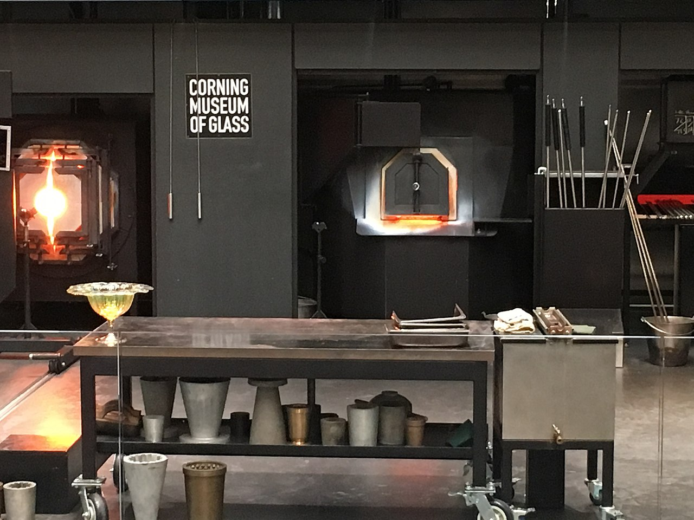

Corning is a city in Steuben County, New York, United States, on the Chemung River. It is primarily known for Corning Museum of Glass,dedicated to the art, history, and science of glass and glassmaking with numerous galleries, exhibitions, and live demonstrations of glassblowing.

By Sally Wilson - Hot Shop, CC BY-SA 2.0, https://commons.wikimedia.org/w/index.php?curid=54822216