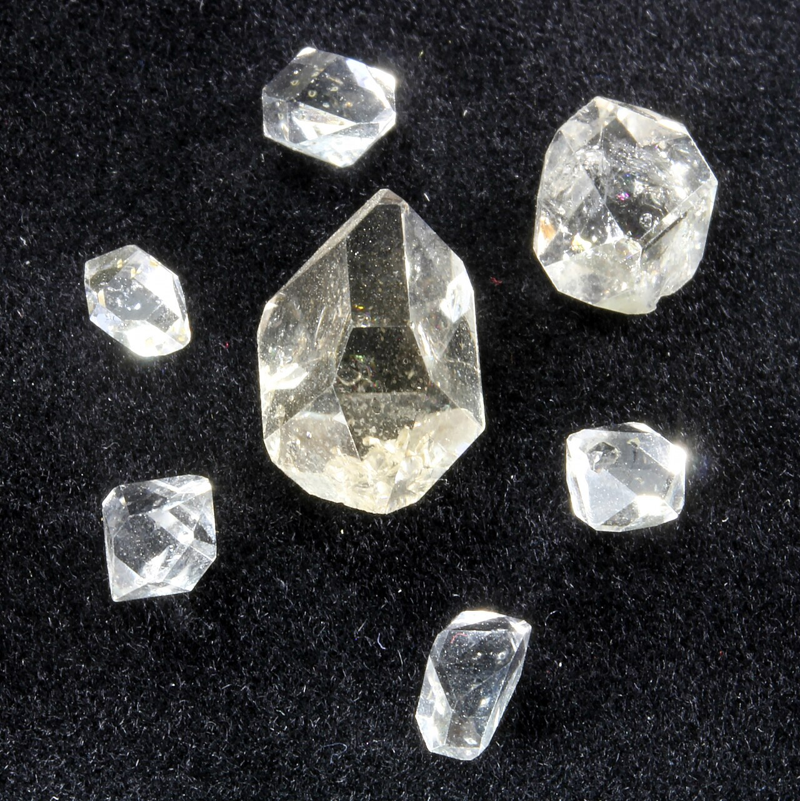

Herkimer consists of a small village is located within the town of Herkimer and Herkimer County. Together, they are referred to as "the Herkimers".

Known for "Herkimer Diamonds" or double-terminated quartz crystals discovered within exposed outcrops of dolomite in the region. A number of museums and other attractions here are open for visitors to mine these crystals out of the rocks.

By Cortez Salvatore De Leon, editing by W.carter - File:A variety of quartz Maramureş diamonds.jpg, CC BY 4.0, https://commons.wikimedia.org/w/index.php?curid=157716002