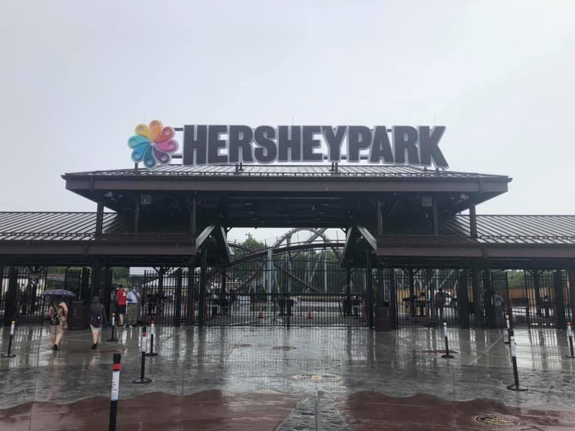

One of the chocolate capitols of the world, Hersey is known for Hershey Country Club, The Hotel Hershey, the Hershey Theatre, Hersheypark Arena, Hersheypark Stadium, and most popular: Hershey's Chocolate World, and Hersheypark theme park with its many rollercoasters and other amusements.

By Jwesser24 - Own work, CC BY-SA 4.0, https://commons.wikimedia.org/w/index.php?curid=122516538