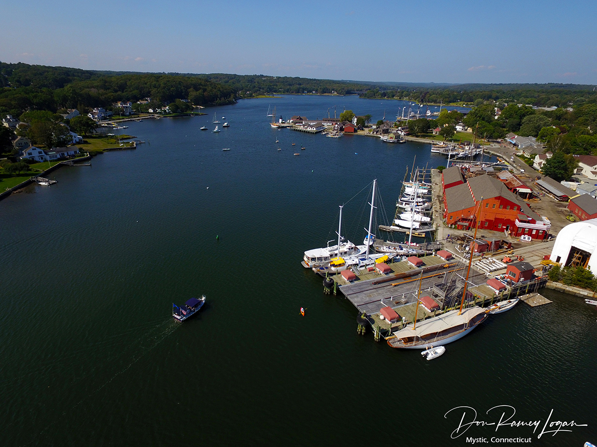

Mystic Connecticut, made up of the towns of Groton and Stonington, is like if Princeton NJ were on a river. Known for the [Mystic Seaport](https://mysticseaport.org/), a massive and sprawling maritime museum similar in scope to Colonial Williamsburg, the [Mystic Aquarium](https://www.mysticaquarium.org/) and [Olde Mistick Village](http://oldemistickvillage.com/) for specialty shopping.

It is also well known for being the setting of the 1988 film "[Mystic Pizza](https://www.imdb.com/title/tt0095690/)" (starring Annabeth Gish, Julia Roberts, and Lili Taylor) named after the restaurant of the same name, which is still in operation today.

It also has close access to the [Pequot Museum](https://www.pequotmuseum.org/), and is a general is a hub for American history.

By Photograph by D Ramey Logan, CC BY 4.0, https://commons.wikimedia.org/w/index.php?curid=92514281