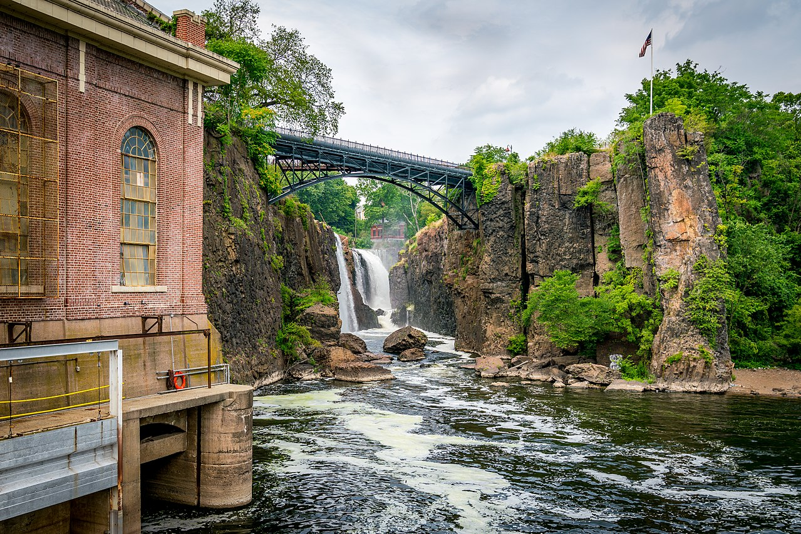

Paterson is the largest city in and the county seat of Passaic County, in the U.S. state of New Jersey.

 It is known for the Patterson Great Falls that are 77 feet (23 m) high, on the Passaic River. One of the United States' largest waterfalls, it played a significant role in the early industrial development of New Jersey starting in the earliest days of the nation. The falls and surrounding area are protected as part of the Paterson Great Falls National Historical Park, administered by the National Park Service. Congress authorized its establishment in 2009.

By FirozAnsari - Own work, CC BY-SA 4.0, https://commons.wikimedia.org/w/index.php?curid=62767882